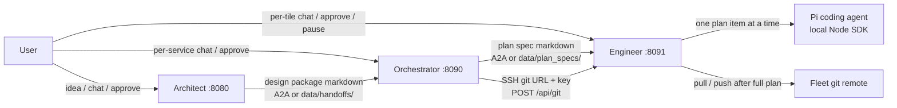

# How the three agents work today

This document describes the **Software Factory as implemented now**: Architect (`:8080`), Orchestrator (`:8090`), and Engineer (`:8091`). It is a code-accurate walkthrough, not a product pitch. Shared workflow key across all three is the architect **`design_session_id`**.

Shorter overview and deploy commands live in [`README.md`](README.md). Per-agent READMEs and `SKILL.md` files are the source of truth for prompts and local run instructions.

---

## 1. Factory at a glance

| Agent | Default URL | Job |
| --- | --- | --- |
| **Architect** | http://127.0.0.1:8080/ | Turn a vague idea into an approved system design (LLD **or** HLD), grade it against the market, hand a design package to the orchestrator. |
| **Orchestrator** | http://127.0.0.1:8090/ | Turn that package into engineer-ready **plan specs** (entity relationships, features, bugs, stack). Does **not** lock protocols or API catalogs. |
| **Engineer** | http://127.0.0.1:8091/ | Run a **fleet of sub-engineers** (one per microservice). Each owns the offered API and implements the plan via the local **Pi** coding agent. |

All three share the same shape:

- React SPA (Vite) built into `backend/src/<pkg>/static/`
- FastAPI BFF (chat / approve / downloads / presence)
- A2A JSON-RPC at `POST /` plus `GET /.well-known/agent-card.json`
- JSON session files on disk
- Shared LLM adapter (`stub` / OpenAI / Anthropic / Ollama / Dell proxies)
- Per-session **presence lease** so two tabs on the **same** session do not both mutate

They do **not** share a Python package. Presence, intent classification, and discussion memory are copied per agent.



Start order from the root `Makefile` is **engineer → orchestrator → architect** so A2A peers are listening before upstream agents start.

---

## 2. Shared conventions

### 2.1 Identity

- **`design_session_id`**: UUID minted by the architect when you `POST /design` (or start via A2A). Orchestrator and engineer **reuse** it. They never mint a new factory key.
- **`microservice_id`**: UUID minted by the orchestrator the first time it extracts a core service. Stable across renames. Stand-alone apps do not use one (engineer uses `app` internally).
- **`design_version`**: integer on the architect package. Orchestrator and engineer treat a new version as a new spec wave.
- **`spec_version`** (orchestrator / engineer, distributed only): increments when that tile ships a plan spec (full or incremental).

### 2.2 Chat rules (all three)

- The **latest user message is the work of the turn**. History is context, not a reason to ignore it.
- Empty / thin `assistant_message` is treated as a failed turn (prompts + post-checks; architect synthesizes a briefing if the model is too short).
- Public text is folded to **ASCII**.
- Do **not** tell the user to click a UI button. Chat and buttons are equivalent (`Approve`, `looks good`, `lgtm`, `next step`, `wrap up`, …).
- Do **not** add **Updates to this proposal** or **What you can do next** footers in user-visible chat.
- LLD and HLD are **mutually exclusive tracks**, not sequential phases.

### 2.3 Session presence (all three)

Implemented in each agent’s `session_presence.py` (same idea, not a shared module).

| Detail | Value |
| --- | --- |
| Lease TTL | ~45 seconds |
| Heartbeat | ~4 seconds (`POST /api/sessions/{id}/presence` with `{ holder_id }`) |
| Release | `POST .../presence/release`; UI also uses `navigator.sendBeacon` on `pagehide` / `beforeunload` |
| Holder id | Per-tab UUID in `sessionStorage` |
| Mutation header | `X-Session-Holder` |
| Conflict | HTTP **423** if another holder owns the lease |

**Locked** on a second tab of the **same** session: chat, approve, pause, execute, retry-handoff, end, git send (whatever that agent mutates).

**Not locked:** GET session, downloads, SSE (engineer), A2A / scripts / tests that send **no** lease (no lease ⇒ allow). Different `design_session_id`s never block each other.

GET responses include `interaction: { holder_id, is_holder, interactive, locked }`. It is **not** persisted in the session JSON.

### 2.4 Discussion memory

Each conversation (architect session, orchestrator stand-alone chat, orchestrator per-tile chat, engineer per-sub-engineer) keeps a **`discussion_digest`**: settled decisions, approvals, rejections, locked topology, blocked-issue instructions. When the chat tail is truncated, the digest is the source of truth — the agent must not re-open settled issues.

Each user turn is **consulted** against the last assistant message. Off-topic or vague replies get a clarification ask; they do not advance the workflow.

### 2.5 Intent classification

Each agent classifies a user turn as **command** vs **information** (LLM JSON + heuristics). Typical command actions:

| Action | Architect | Orchestrator | Engineer |
| --- | --- | --- | --- |
| `approve` | Advance step / send design / continue after market | Advance tile step / ship spec | Approve plan or continue after a block |
| `revise` | Change the current artifact | Change the current tile artifact | Change the execution plan (only when not executing) |
| `answer` | Q&A only | Q&A only | Q&A only |
| `pause` / `execute` | Coerced to chat in wait nodes | n/a | Pause / start the **whole plan** |
| `stop_item` / `resume_item` / `undo_item` | n/a | n/a | Control **Pi on the current item** |

---

## 3. Architect (`architect-agent`, `:8080`)

**Role:** Principal Software Architect. Structured design interview, living spec, trade-off ledger, Mermaid diagram, market grade, then a design package for the orchestrator.

### 3.1 Process and storage

| Piece | Location |
| --- | --- |
| Bind | `HOST` / `PORT` (default `127.0.0.1:8080`) |
| UI | Vite build → `backend/src/architect_agent/static/`; dev proxy `:5173` → `:8080` |
| Session JSON | `backend/data/sessions/{design_session_id}.json` |
| LangGraph checkpointer | `backend/data/checkpoints.sqlite` (`thread_id` = session id) |
| Failed / offline handoffs | `backend/data/handoffs/{session_id}-v{version}-{stamp}.md` |
| Graph | `START → phase0_classify → phase0_wait ⇄ lld_* or hld_* → market_research → market_wait → phase0` |

Two stores stay in sync: **LangGraph state** (resumable interrupts) and **SessionStore** (what the UI shows). Wait nodes call LangGraph `interrupt()`; the BFF resumes with `Command(resume={action, text})`.

There is **no** `GET /api/sessions` list and **no SSE**. The home page starts a new design; you resume by opening `/sessions/{id}`. A locked (non-holder) tab polls GET every ~3s.

### 3.2 Starting a session

`POST /design` (form `markdown` and/or uploaded `.md`) or A2A start.

Returns `design_session_id`, `ui_url` (`/sessions/{id}`), current phase, and the first assistant message.

Home page copy walks Phase 0, then LLD 1–3 **or** HLD 1–6, then market + handoff.

### 3.3 Phase 0 — scope and track

Every round (including after a handoff) starts here.

1. If the spec is sparse, the architect may web-search and ask **one** concrete interview question at a time (named choice + recommended default). Never “tell me more.”
2. Answers fold into the **living spec** (`business_spec`).
3. User approves the compiled spec.
4. Classify **`design_track`**: `lld` or `hld`. It must not stay `unset`.
5. Approve **Confirm scope & start track** → enter that track at step 1.

**LLD** — single OS process (local stand-alone, desktop, modular monolith on one host). Object-oriented class / structure diagram. Not API-gateway / CDN infra.

**HLD** — distributed because the **user wants that topology**. Capacity, domain objects, core microservices, communication *schemes* (not endpoint catalogs), FMEA, system diagram.

Analogies (YouTube, Netflix, Uber) do **not** lock a track. An explicit stand-alone / local request **overrides** a prior HLD lean and stops Kafka / CDN / multi-region proposals.

### 3.4 LLD track (steps 1–3)

| Step | Title | Primary artifact |
| --- | --- | --- |
| 1 | Information gathering | `## In-process rules` in the living spec |
| 2 | Architectural blueprint | Class/structure Mermaid (`design_diagram`) + justification |
| 3 | Verification | Walk blueprint vs invariants; `design_ready_to_approve` |

Approve labels look like `Confirm gathering → blueprint`, then **Approve & send design** on step 3 (that approve goes to **market evaluation**, not straight to the orchestrator).

### 3.5 HLD track (steps 1–6)

| Step | Title | Primary artifact (state field) |
| --- | --- | --- |
| 1 | Requirements & capacity estimation | FR / NFR / scale (`scale_estimates`) |
| 2 | Domain object modeling | `## Domain model` in the living spec |
| 3 | Core microservices | Owned objects, operations, collaborators (`api_contracts`). **No** HTTP METHOD/path catalogs. |
| 4 | Communication schemes, infrastructure & system diagram | Named styles (REST, gRPC, Kafka, …), CAP/PACELC, Mermaid system diagram (`communication_schemes`, `design_diagram`) |
| 5 | Vulnerability & edge-case analysis (FMEA) | Failure-mode table (`fmea_notes`) |
| 6 | Session synthesis & wrap-up | Summary + ledger; **Approve & send design** → market |

**Never skip ahead.** If the user asks to jump, the agent stays on the current step and explains the walk order.

If a change belongs to an **earlier** stage (e.g. a new v1 requirement while modeling services), the session **rewinds** to that stage and walks forward again. Later artifacts are **kept and patched**, not thrown away (`design_progress.py`: `rewind_or_block_skip()`, `rewalk_until_step`).

### 3.6 Chat vs buttons

| UI control | API | Effect |
| --- | --- | --- |
| Send | `POST /api/sessions/{id}/chat` | Classify then resume (`approve` / `revise` / `answer`) |
| Approve (label from `approve_label`) | `POST .../approve` | Advance step, enter market, or continue after market |
| Retry handoff vN | `POST .../retry-handoff` | Resend last package (same version) if last handoff was `failed` or `queued` |
| End session | `POST .../end` | `session_done` |
| Downloads | GET spec / market-evaluation / final | Living spec, market report, design package |

There is **no** separate “send design” route. Delivery happens when the user **approves on the market-evaluation wait** (“Continue after market evaluation”).

`approve_kind`: `advance` (mid-track), `design` (LLD 3 / HLD 6), `continue_after_market`.

### 3.7 Market evaluation

Runs **only** after a full design-version approve (LLD 3 or HLD 6). Intermediate step advances do **not** trigger it.

The node plans a few DuckDuckGo queries (skipped when `LLM_PROVIDER=stub` or `MARKET_RESEARCH_WEB_ENABLED=false`), then writes `market_evaluation_report`, `market_evaluation_grade` (A–F), and `market_evaluation_done`.

Approve **Continue after market evaluation**:

1. Graph returns to **Phase 0** (`design_step=0`, keep-and-patch `rewalk_until_step`).
2. `SessionStore._publish_design_to_orchestrator()` builds the package from workflow tiles and delivers it.

### 3.8 Handoff to the orchestrator

Package (`workflow.py` → `package_from_workflow()`):

- Header: session id, design version, track/step, timestamp
- One `## {tile title}` section per workflow tile (spec, scale, services, schemes, diagram, FMEA, market, ledger, …)

Fingerprint ignores version/timestamp lines. If the fingerprint matches `last_published_fingerprint` and a version was already sent, the architect **does not send a duplicate**. It tells the user there is nothing new and stays at Phase 0.

Delivery:

- If `ORCHESTRATOR_AGENT_URL` is set → A2A `send_message`
- Else or on failure → write under `backend/data/handoffs/`
- Status: `sent` | `queued` | `failed`

After **every** attempt (success, queue, failure) **and** after a skipped duplicate, a **new design round starts at Phase 0**. The user may change the spec or walk the same track again.

### 3.9 Workflow tiles (UI)

Left rail + articles from `architect_workflow()`:

- `phase0` — Phase 0 - Scope and spec
- `lld1`–`lld3` **or** `hld1`–`hld6` (only the active track)
- `market` — Market evaluation
- `ledger` — Trade-off ledger (if non-empty)

Tile status: `current` | `done` | `pending`. A full-width Mermaid panel shows when a diagram is due. Edge hover notes come from `## Diagram relationships` in the spec.

### 3.10 Skills

- `skills/principal-architect/SKILL.md` and `skills/grill-me/SKILL.md` exist on disk.
- Runtime prompts use **inlined digests** in `context_budget.py` (`PRINCIPAL_ARCHITECT_DIGEST`, `INTERVIEW_TECHNIQUE_DIGEST` / grill-me). The files are not loaded on each turn.

### 3.11 Architect API

| Method | Path |
| --- | --- |
| POST | `/design` |
| GET | `/api/sessions/{id}` |
| POST | `/api/sessions/{id}/presence` |
| POST | `/api/sessions/{id}/presence/release` |
| POST | `/api/sessions/{id}/chat` |
| POST | `/api/sessions/{id}/approve` |
| POST | `/api/sessions/{id}/retry-handoff` |
| POST | `/api/sessions/{id}/end` |
| GET | `/api/sessions/{id}/download/spec` |
| GET | `/api/sessions/{id}/download/market-evaluation` |
| GET | `/api/sessions/{id}/download/final` |
| GET | `/healthz`, `/`, `/sessions/{id}` |
| POST | `/` (A2A JSON-RPC) |

Important env: `ORCHESTRATOR_AGENT_URL` (unset ⇒ queue locally), `MARKET_RESEARCH_WEB_ENABLED`, standard `LLM_*` keys.

Smoke: `LLM_PROVIDER=stub uv run python scripts/test_principal_architect_flow.py` from `architect-agent/backend`.

---

## 4. Orchestrator (`orchestrator-agent`, `:8090`)

**Role:** Delivery planner. Classify topology, interview **entity relationships / features / stack** (not protocols), emit plan specs, optionally send the fleet git remote to the engineer.

### 4.1 Process and storage

| Piece | Location |
| --- | --- |
| Bind | `127.0.0.1:8090` |
| UI | static under `backend/src/orchestrator_agent/static/`; dev `:5174` |
| Session JSON | `backend/data/sessions/{design_session_id}.json` |
| Checkpointer | `backend/data/checkpoints.sqlite` |
| Inbound architect packages | `backend/data/handoffs/{session}-v{version}-{stamp}.md` |
| Outbound plan specs | `backend/data/plan_specs/` (always written, even when A2A succeeds) |
| Git secrets | `backend/data/secrets/{design_session_id}.json` (mode `0600`; never in public JSON) |

Graph nodes (simplified):

```
ingest → classify → handle_update
  → stand-alone: feature_discuss → stack_research → emit_plan → wait (idle, often locked)
  → distributed: extract_services → prime_all → wait
       per tile: relations → features → stack → emit_plan
       after ship: spec_update → emit_plan
```

`wait_node` interrupts with `{action, text, service_id}`. Resume is per tile when `service_id` is set.

Unlike the architect, orchestrator **lists** sessions: `GET /api/sessions`. No SSE; the session page polls GET about every 4s.

### 4.2 How packages arrive

1. Architect A2A → `OrchestratorAgentExecutor` parses the package, ACKs, ingests in a background thread.
2. `POST /ingest` form field `markdown` (tests / retries).
3. `POST /api/sessions/{id}/retry-ingest` re-runs the saved package.

Parser (`package_parse.py`) reads `design_session_id`, `design_version`, and `architect_track` (`lld` | `hld`) from HTML comments and/or body lines.

### 4.3 Topology

`classify_node` outputs `standalone` | `distributed` plus `certain`. Bias: architect LLD → stand-alone, HLD → distributed, unless the package or the user clearly says otherwise. User can force with words like “standalone” or “microservices.”

If **not certain**, the UI asks to confirm topology (`approve_kind: confirm_topology`). If certain, it continues into `handle_update`.

### 4.4 Stand-alone flow

1. Treat the architect package as a **sketch**.
2. Interview **every v1 feature** (who it is for, success/failure, what is out of v1) until **Approve features**.
3. Research a tech stack (DuckDuckGo when enabled and not stub) until **Approve plan**.
4. Emit one plan spec (features + stack + full architect package) and send it to the engineer.
5. `app_status` becomes `sent`. **Discussion locks** (`discussion_locked`) until the architect sends another package. The UI stays readable. Chat/approve return HTTP 409 except ingest.

A new architect package with the **same** track/topology clears stack/plan and re-runs the feature interview (prior feature list is a starting point).

### 4.5 Distributed flow

1. **Extract** core product services from **Core Microservices** (not pure infra). First sight: new UUID. Updates: match by **role / name**, keep UUID.
2. **Prime all tiles at once.** Every live service gets a draft entity-relationship map and `status: awaiting_relations`. The user discusses tiles independently. When a tile is open, talk **only about that service**. Other services appear only as collaborators. Shared infra (CDN, Kafka, Redis) only if **this** service owns or calls it.
3. Per tile, in order:
   - **Entity relationships** — users, peer core services, infra. Who initiates, what data/commands/events flow, why. **No** REST catalogs, gRPC RPCs, or Kafka topic lists. Engineer sub-agents own protocols when the initiator consults the peer.
   - **Features** — thorough v1 interview (architect package is a sketch).
   - **Stack** — this service’s language, framework, tests, datastore.
   - **Approve plan** → emit plan spec with `design_session_id` **and** `microservice_id`, `spec_version` 1, `update_kind: full`.

Approve labels on tiles: **Approve relationships** → **Approve features** → **Approve plan**. Features must be concrete (`features_are_concrete()`); spec updates must have a real delta (`spec_delta_is_ready()`).

Each tile has an **interview-results** icon that opens a modal of that service’s artifacts.

### 4.6 After the first ship (distributed)

The tile stays **open**. Chat goes to `spec_update`: patch existing/new **features and bugs**, then **Ship spec update**. Entity map and stack stay. Asking to redo relationships / first-pass features / stack is **refused** (`FULL_PHASE_REFUSAL`) until a **new architect design package** arrives.

A new architect package with the **same** track:

- Match services by role; **suspend** removed UUIDs (engineer gets `action: suspend`).
- Full re-walk of every live service: relations → features → stack again (prior `feature_spec` is a starting point). UUIDs kept for matches.

If **track or topology flips** (HLD ↔ LLD, or stand-alone ↔ distributed):

- Suspend **all** prior units immediately (stand-alone unit and every live service).
- Treat as a first version: empty `services`, **new UUIDs** on next extract.

### 4.7 Plan spec markdown (what the engineer parses)

Always written under `backend/data/plan_specs/` first, then A2A if `ENGINEER_AGENT_URL` is set.

**Distributed (per service):**

```markdown
# Plan spec
- action: `plan`
- design_session_id: `{uuid}`
- design_version: `{n}`
- spec_version: `{n}`
- update_kind: `full` | `incremental`
- microservice_id: `{uuid}`
- microservice_name: `{name}`

## Entity relationships
## Features / functionality
## Bugs
## Spec updates
## Tech stack
## System design (architect package)
```

**Stand-alone** omits `microservice_id` / entity map; includes features, stack, and the architect package.

**Suspend:**

```markdown
# Suspend development
- action: `suspend`
- design_session_id / design_version / microservice_id / reason
```

Handoff record on the session: `status` `sent` | `queued` | `failed`, path, target URL, microservice id. Shown as `engineer_handoffs[]` / `last_handoff`.

### 4.8 Git repo panel

On the orchestrator session page:

1. Paste SSH remote URL + private key (**Save** → `PUT /api/sessions/{id}/git`).
2. Orchestrator validates URL/key and stores the key only under `data/secrets/` (fingerprint may appear in the UI; the key never comes back from GET).
3. **Send to engineer** → `POST .../git/send`:
   - If `GIT_VERIFY_ENABLED=true`, run `git ls-remote --heads` with a temp key file.
   - `POST {ENGINEER_AGENT_URL}/api/git` with `{ design_session_id, git_repo_url, ssh_private_key }`.
4. Failures stay on the panel with **Resend to engineer**. This path does **not** write the key into `plan_specs/`.

### 4.9 Service statuses (distributed)

`planning`, `awaiting_relations` (legacy aliases `awaiting_comms` / `awaiting_api_type` / `awaiting_api_design` still route to relations), `discussing_features`, `awaiting_features`, `awaiting_stack`, `sent`, `approved`, `discussing_spec_update`, `awaiting_spec_update`, `suspended`.

Stand-alone `app_status`: `planning`, `discussing_features`, `awaiting_features`, `awaiting_stack`, `sent`.

### 4.10 Orchestrator API

| Method | Path |
| --- | --- |
| POST | `/ingest` |
| GET | `/api/sessions` |
| GET | `/api/sessions/{id}` |
| POST | `/api/sessions/{id}/presence` (+ `/release`) |
| POST | `/api/sessions/{id}/chat` `{ message, service_id? }` |
| POST | `/api/sessions/{id}/approve` `{ service_id? }` |
| POST | `/api/sessions/{id}/end` |
| POST | `/api/sessions/{id}/retry-ingest` |
| GET | `/api/sessions/{id}/download/plan` |
| PUT | `/api/sessions/{id}/git` |
| POST | `/api/sessions/{id}/git/send` |

Important env: `ENGINEER_AGENT_URL` (default in `.env.example` is `:8091`; unset ⇒ queue only), `GIT_VERIFY_ENABLED`.

Smoke: `LLM_PROVIDER=stub uv run python scripts/test_orchestrator_flow.py` from `orchestrator-agent/backend`.

---

## 5. Engineer (`engineer-agent`, `:8091`)

**Role:** Implementation fleet. One **sub-engineer** per `(design_session_id, microservice_id)`. Owns the **offered API / protocol**, drafts an **execution plan**, then codes via **Pi** in a private git folder.

The engineer does **not** use LangGraph. `SessionStore` + a background worker thread per executing sub-engineer is the runtime.

### 5.1 Process and storage

| Piece | Location |
| --- | --- |
| Bind | `127.0.0.1:8091` |
| UI | static under `backend/src/engineer_agent/static/`; dev `:5175` |
| Fleet JSON | `backend/data/sessions/{design_session_id}.json` |
| Workspaces | `WORKSPACES_DIR` (default `backend/data/workspaces/`) |
| Pi runner | `backend/src/engineer_agent/pi_runner/` (`npm install` / `make install-pi-runner`) |
| Git secrets | engineer `secrets_store` (key never in `to_public()`) |

**SSE:** `GET /api/sessions/{id}/events` streams the public fleet JSON so the UI does not poll. (Architect and orchestrator do not have this.)

### 5.2 How work arrives

- Orchestrator A2A or `POST /ingest` with plan-spec markdown.
- Parser (`plan_parse.py`) reads `action`, `design_session_id`, `design_version`, `microservice_id`, `microservice_name`, and sections: entity relationships, features, bugs, stack.
- `action: plan` → create/update that sub-engineer (`_upsert_plan`).
- `action: suspend` → status `suspended`, stop any coding loop.
- `POST /api/git` → store fleet repo URL + SSH key (from the orchestrator git panel).

A **new spec version** while coding:

1. Stop the in-flight loop.
2. Keep `previous_plan_spec` / `previous_execution_plan` / `interrupted_from`.
3. Draft a **new** offered API and execution plan (LLM compares old vs new).
4. Status `awaiting_plan`. Do not code until approve (or execute after a later pause).

### 5.3 Sub-engineer lifecycle

```
ingest → awaiting_plan  --approve-->  executing  --all items done-->  shipped
                ^                       |  |
                |                       |  +-- blocker --> blocked --approve to continue--> executing
                |                       +-- Pause --> paused --chat revise--> paused --Execute--> executing
                +-- new architect/orchestrator spec --
```

| Status | Meaning |
| --- | --- |
| `planning` | Empty shell before first draft |
| `awaiting_plan` | Offered API + execution plan ready; user may revise or approve |
| `executing` | Worker walking items; **plan locked** |
| `paused` | User paused the **whole plan** to revise it |
| `blocked` | Issue on the **current item** (git pull, peer contract, tests). Not the same as pause. |
| `shipped` | Every item terminal; git push attempted |
| `suspended` | Orchestrator removed this service or flipped topology |

`can_approve` is true for `awaiting_plan` (has items) and `blocked`. `can_pause` only while `executing`. `can_execute` only while `paused`. `plan_locked` while `executing` or `blocked`.

### 5.4 Offered API and execution plan

On ingest the sub-engineer LLM-drafts:

- **`offered_api`** — the protocol **this** service exposes. Callers and peer sub-engineers that initiate toward it consume this. The orchestrator relationship map does **not** lock this.
- **`execution_plan`** — items of kind `feature` | `bug` | `feature_update`, each with `id`, `title`, `priority`, `depends_on`, `peer_services`, `status`, `notes`, `contracts`.

Chat while `awaiting_plan` or `paused` can **revise** the plan. Approve starts `_start_execute_locked`, which **transitions** from `previous_execution_plan`: completed items whose **titles** still exist stay `done`; everything else restarts as `pending`.

### 5.5 Coding loop (one item at a time)

Background worker (`BACKGROUND_EXECUTE=true`, default) or tests call `tick_execution`.

`_prepare_next_item_locked`:

1. If `pi_hold` → wait (do not start the next item).
2. Pick `next_runnable_item` (blocked first, then `in_progress`, then highest-priority `pending` whose deps are terminal).
3. If the item lists `peer_services`, snapshot those peers’ `offered_api` as contracts. Missing peer → **block** (`peer_contract`). User instructions on a block can stand in for a missing contract.
4. Ensure workspace: if `GIT_EXECUTE_ENABLED`, clone/pull the fleet repo with the stored SSH key; create a **private folder at repo root** named after the microservice (sanitize illegal path characters; suffix id on collision). Failure → **block** (`git_pull`).
5. Mark item `in_progress`, chat “Handing **title** to Pi…”.

Then, **outside** the session lock (so Pi does not freeze the UI):

`implement_plan_item()` (`pi_coder.py`):

1. Write `items/<id>/README.md` + `SPEC.md` (feature/bug spec, offered API, stack, contracts, resume instructions).
2. **Snapshot** the whole private folder (except `.pi-snapshots`, `.git`, `__pycache__`, `node_modules`, `.venv`) to `.pi-snapshots/<id>/before`.
3. If `PI_CODER_ENABLED=false` (tests): write local `impl.py` / `test_impl.py` stubs and return.
4. Else spawn Node `pi_runner/run_item.mjs` with cwd = private dir.

Pi pipeline (SDK `@earendil-works/pi-coding-agent`):

1. Write `test_*.py` from the spec (no implementation yet).
2. Implement.
3. Run `python -m unittest discover -s <item-dir> -p test_*.py`.
4. On fail, implement again (up to `PI_CODER_MAX_ROUNDS`, default 5).
5. On pass, return a short summary (`.pi-result.json`).

`stop_check` (pause / stop-item / undo) **terminates** the Node process. Timeout default 900s (`PI_CODER_TIMEOUT_SECONDS`). Pi wants Node **≥ 22.19**; host Node older than that is a known foot-gun. Needs `~/.pi/agent` login/API key on the engineer machine.

`_finish_item_locked`:

- Official `run_workspace_tests` on the private folder.
- Fail → **block** (`tests_failed`). Chat + tile banner. Do not start the next item.
- Pass → item `done`; notes + `implementation_notes`; rewrite **`IMPLEMENTATION_STATUS.md`** in the private folder and store the same markdown on `sub.implementation_status`; chat that Pi finished and the status file was updated.
- If every item is `done` or `skipped` → **ship once** (`git push` if git execute is on). Status `shipped`.

### 5.6 Blockers vs plan pause vs Pi item commands

Three different stops:

| Mechanism | How | What it does |
| --- | --- | --- |
| **Blocked** | Git / peer / tests fail | Status `blocked`. Chat instructions. **Approve to continue** retries that item (not Execute plan). |
| **Pause plan** | Pause button or `pause` / `stop the plan` / `stop execution` | Status `paused`. Unlock the plan. Revise, then **Execute plan**. Transitions completed work. |
| **Stop / resume / undo item** | Chat only (see below) | Plan stays `executing`. Only the current Pi item is held, restored, or restarted. |

While `executing`, revising the plan in chat is **rejected** (`PermissionError`) unless you pause first. Q&A and peer-data requests (“need more/less data from X”) still work.

**Approve to continue** (blocked) is not **Execute plan**. Execute is only after a user pause (or first approve from `awaiting_plan`).

### 5.7 Chat commands for Pi (current item)

Classified **before** the LLM, so they are not mistaken for plan-wide pause/execute (`query_intent.classify_pi_item_command`).

| Command | Example phrases | Effect |
| --- | --- | --- |
| `stop_item` | `stop working on current feature`, `stop fixing this bug`, `stop this item`, `stop coding`, `stop pi` | Kill Pi if running; item → `stopped`; `pi_hold=true`; worker will not pick the next item. **Not** `stop the plan`. |
| `resume_item` | `resume this item`, `resume working on this feature`, `resume coding` | Stopped item → `pending`; clear hold; if the sub was `paused`, start execute. Bare `resume` still means execute the **plan**. |
| `undo_item` | `undo`, `undo the changes`, `discard pi changes`, `revert this feature` | Restore `.pi-snapshots/<id>/before` (SPEC/README remain; Pi impl/tests go away); item → `stopped`; rewrite status file. If nothing is in progress, undoes the last `done` item. |

After the command is applied, the tile chat says it **executed successfully**. If Pi is still running (`BACKGROUND_EXECUTE`), chat sets `pi_command` + stop flag and waits briefly for the worker to apply it (avoids holding the session lock across the Node process).

`stopped` items are not runnable and not terminal. A plan that is all `done` + `stopped` will not ship until those items are resumed and finished (or skipped by a later plan transition).

### 5.8 Implementation status view

After a successful item:

- File: `{private_dir}/IMPLEMENTATION_STATUS.md` — table of items (title, kind, status) plus per-item notes/summaries.
- Field: `implementation_status` on the sub (folded ASCII for the API).
- UI: document **icon** on the tile header. Enabled when the field is non-empty; opens a modal of that markdown.

### 5.9 Peer consults

If the relationship map says **this** service initiates toward another core service, the sub-engineer:

- Lists that peer on items that need them.
- Before coding, copies the peer’s **offered API** into `item.contracts`.
- If it needs more or less data than that API provides, it **asks the peer sub-engineer** (same fleet). It does not invent a private contract or reach into the peer datastore.

Peers that initiate toward **you** consume **your** offered API. You do not redesign them.

### 5.10 Engineer API

| Method | Path |
| --- | --- |
| POST | `/ingest` |
| POST | `/api/git` |
| GET | `/api/sessions` |
| GET | `/api/sessions/{id}` |
| GET | `/api/sessions/{id}/events` (SSE) |
| POST | `/api/sessions/{id}/presence` (+ `/release`) |
| POST | `/api/sessions/{id}/chat` `{ message, service_id? }` |
| POST | `/api/sessions/{id}/approve` `{ service_id? }` |
| POST | `/api/sessions/{id}/pause` `{ service_id? }` |
| POST | `/api/sessions/{id}/execute` `{ service_id? }` |
| GET | `/api/sessions/{id}/download/package` |

Important env (defaults in `config.py`):

| Variable | Default | Role |
| --- | --- | --- |
| `BACKGROUND_EXECUTE` | `true` | Worker thread vs test `tick_execution` |
| `GIT_EXECUTE_ENABLED` | `true` | Live clone/pull/push |
| `PI_CODER_ENABLED` | `true` | Pi SDK vs stub writer |
| `PI_NODE_BIN` | `node` | Node binary |
| `PI_CODER_MAX_ROUNDS` | `5` | Implement/test retries |
| `PI_CODER_TIMEOUT_SECONDS` | `900` | Kill hung Pi |

Smoke: `LLM_PROVIDER=stub PI_CODER_ENABLED=false BACKGROUND_EXECUTE=false GIT_EXECUTE_ENABLED=false uv run python scripts/test_engineer_flow.py` from `engineer-agent/backend`.

---

## 6. End-to-end walk (what a user actually does)

### 6.1 Distributed product

1. **Architect home** — paste a business spec → new `design_session_id`.
2. Phase 0 interview → confirm **HLD**.
3. Walk HLD 1–6. Chat to change artifacts; approve each step. Do not skip. Rewind if you change an earlier stage.
4. Approve the design version → market report + grade.
5. **Continue after market evaluation** → package to orchestrator (A2A if `:8090` is up). Architect returns to Phase 0.
6. Open **the same id** on the orchestrator (`:8090/sessions/{id}`). Confirm distributed if asked.
7. Every core service tile is already primed. On each tile: approve relationships → features → stack → plan. Discuss only that service.
8. Optionally **Save + Send** git SSH on the orchestrator session.
9. Open **the same id** on the engineer (`:8091/sessions/{id}`). One tile per service, already in `awaiting_plan`.
10. Revise or **Approve plan**. Worker + Pi implement item by item. Watch SSE. Open the status icon after items finish.
11. If tests/git/peers fail: chat instructions, **Approve to continue**.
12. To change the plan: **Pause**, chat, **Execute plan**.
13. To stop only the current feature: chat `stop working on current feature` (then `resume this item` or `undo the changes`).
14. After ship: back on orchestrator, add features/bugs on a tile and **Ship spec update** (no full re-walk). Or send a **new architect package** to re-walk every phase.

### 6.2 Stand-alone / LLD app

Same through architect, but Phase 0 classifies **LLD** (3 steps, class diagram). Orchestrator interviews features + stack once, emits one plan spec (no `microservice_id`), then **locks** until the next architect package. Engineer uses microservice id `app` and a single tile.

---

## 7. Failure and offline behavior

| Hop | If the peer is down |
| --- | --- |
| Architect → orchestrator | Package written under `architect-agent/backend/data/handoffs/`. UI offers **Retry handoff**. |
| Orchestrator → engineer (plan) | Spec written under `orchestrator-agent/backend/data/plan_specs/`. Handoff status `queued` or `failed`. |
| Orchestrator → engineer (git) | Panel shows `git_send_status: failed` and the error; **Resend**. |
| Engineer git pull/push | Item or ship **blocks**; chat + approve to continue / retry. |
| Pi missing / Node too old / SDK not installed | `implement_plan_item` returns an error → tests-failed block (or use `PI_CODER_ENABLED=false` for stubs). |

Architect often runs with `reload=False`. After a **UI** rebuild, hard-refresh the browser. After **Python** changes, restart that agent (`make -C <agent> run` or factory `make restart`). Do not assume a running process picked up new code.

---

## 8. Repository map

```
software-factory/
  Makefile                         # deploy / teardown / status / logs (.run/)
  README.md                        # short overview + mermaid
  HOW_THE_AGENTS_WORK.md           # this file
  architect-agent/
    backend/src/architect_agent/   # FastAPI, LangGraph, sessions, A2A
    ui/                            # Vite React → backend static/
    skills/principal-architect/
    skills/grill-me/
  orchestrator-agent/
    backend/src/orchestrator_agent/
    ui/
    skills/orchestrator/
  engineer-agent/
    backend/src/engineer_agent/    # sessions, workspace, pi_coder, pi_runner/
    ui/
    skills/engineer/
```

Factory deploy from the repo root:

```bash
# copy each agent/.env.example → .env and set LLM + peer URLs
make deploy      # install, build UIs, start engineer → orchestrator → architect
make status      # pid + /healthz
make logs        # tail .run/*.log
make teardown    # stop all
```

Peer URLs that must be set for a live factory:

- `architect-agent/.env` → `ORCHESTRATOR_AGENT_URL=http://127.0.0.1:8090`
- `orchestrator-agent/.env` → `ENGINEER_AGENT_URL=http://127.0.0.1:8091`

---

## 9. What each agent does *not* do

| Agent | Does not |
| --- | --- |
| **Architect** | Own delivery plans, engineer APIs, or git remotes. Does not run LLD then HLD as two phases. Does not stream SSE. |
| **Orchestrator** | Lock REST/gRPC/Kafka catalogs or write code. Does not re-walk relations/features/stack after the first ship unless a **new architect package** arrives. Does not stream SSE. |
| **Engineer** | Invent the product topology or mint `design_session_id`. Does not ship to git after each item. Does not treat **Execute plan** as “continue after a blocker.” Does not use LangGraph. |

---

## 10. Code entry points

| Concern | File |
| --- | --- |
| Architect graph | `architect-agent/backend/src/architect_agent/graph/__init__.py` |
| Architect sessions / handoff | `architect-agent/backend/src/architect_agent/sessions.py` |
| Architect package tiles | `architect-agent/backend/src/architect_agent/workflow.py` |
| Architect rewind | `architect-agent/backend/src/architect_agent/design_progress.py` |
| Orchestrator graph | `orchestrator-agent/backend/src/orchestrator_agent/graph/__init__.py` |
| Orchestrator services / matching | `orchestrator-agent/backend/src/orchestrator_agent/graph/nodes/services.py` |
| Orchestrator emit + engineer A2A | `orchestrator-agent/backend/src/orchestrator_agent/graph/nodes/stack.py`, `a2a/engineer.py` |
| Orchestrator git | `orchestrator-agent/backend/src/orchestrator_agent/git_access.py` |
| Engineer fleet + worker | `engineer-agent/backend/src/engineer_agent/sessions.py` |
| Engineer plan parse | `engineer-agent/backend/src/engineer_agent/plan_parse.py` |
| Engineer workspace / snapshot / status md | `engineer-agent/backend/src/engineer_agent/workspace.py` |
| Engineer Pi handoff | `engineer-agent/backend/src/engineer_agent/pi_coder.py`, `pi_runner/run_item.mjs` |
| Presence (each agent) | `*/session_presence.py` + `*/ui/src/sessionPresence.ts` |
