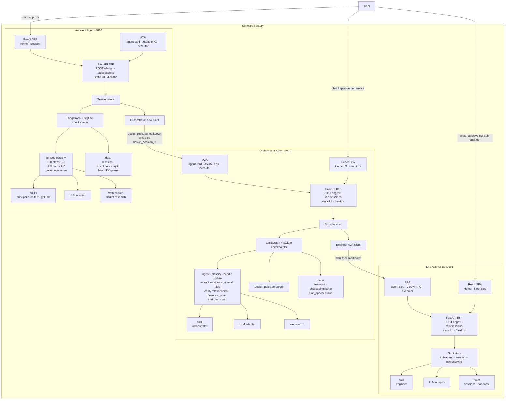
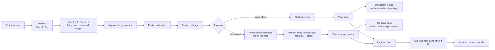

# Software Factory

A local multi-agent design factory. The **Architect** turns a vague idea into an approved system design; the **Orchestrator** turns that design into engineer-ready plan specs; the **Engineer** runs a fleet of sub-engineers that own each microservice's offered API. All three expose a React UI, a FastAPI BFF, and an A2A JSON-RPC surface. They share the architect `design_session_id` as the workflow key.

| Agent | UI / API | Default URL |
| --- | --- | --- |
| Architect | design interview, LLD/HLD, market eval | http://127.0.0.1:8080/ |
| Orchestrator | entity relationships + stack, engineer handoff | http://127.0.0.1:8090/ |
| Engineer | sub-engineer fleet, offered APIs, peer consult | http://127.0.0.1:8091/ |

Set `ENGINEER_AGENT_URL=http://127.0.0.1:8091` in `orchestrator-agent/.env`. If that peer is down, plan specs still land under `orchestrator-agent/backend/data/plan_specs/`.

## Architecture



Same `design_session_id` on all three UIs. Architect handoff is A2A to `ORCHESTRATOR_AGENT_URL` (default `:8090`); if that peer is down, packages land in `architect-agent/backend/data/handoffs/`.

## Design-to-plan flow



**Distributed:** every live microservice is discussed at once. The orchestrator maps related entities and who initiates; it does not lock protocols. Reopen `/sessions/{design_session_id}` on the orchestrator to change relationships and hand off again. The engineer opens a matching sub-engineer tile (`design_session_id` + `microservice_id`) that owns the offered API and consults peers it initiates toward.

**Stand-alone:** after the first engineer handoff, orchestrator chat/approve are locked until the architect sends another package. The session remains readable in the UI.

## Repository

```
software-factory/
  Makefile                 # deploy / teardown the whole factory
  architect-agent/         # Principal Architect — see architect-agent/README.md
    backend/               # FastAPI + A2A + LangGraph
    ui/                    # Vite React SPA → backend static/
    skills/                # principal-architect, grill-me
  orchestrator-agent/      # Delivery planner — see orchestrator-agent/README.md
    backend/
    ui/
    skills/                # orchestrator
  engineer-agent/          # Sub-engineer fleet — see engineer-agent/README.md
    backend/
    ui/
    skills/                # engineer
```

## Deploy

From this directory:

```bash
make deploy      # .env, install, build UIs, start all agents
make teardown    # stop all agents
make status      # pid + /healthz
make logs        # tail .run/*.log
```

Copy each agent's `.env.example` to `.env` and set `LLM_PROVIDER` / keys there. Set `ORCHESTRATOR_AGENT_URL` in `architect-agent/.env` to point to the orchestrator (default `http://127.0.0.1:8090`). Set `ENGINEER_AGENT_URL` in `orchestrator-agent/.env` to point to the engineer (default `http://127.0.0.1:8091`).

Single-agent foreground run: `make -C architect-agent deploy`, `make -C orchestrator-agent deploy`, or `make -C engineer-agent deploy`.
